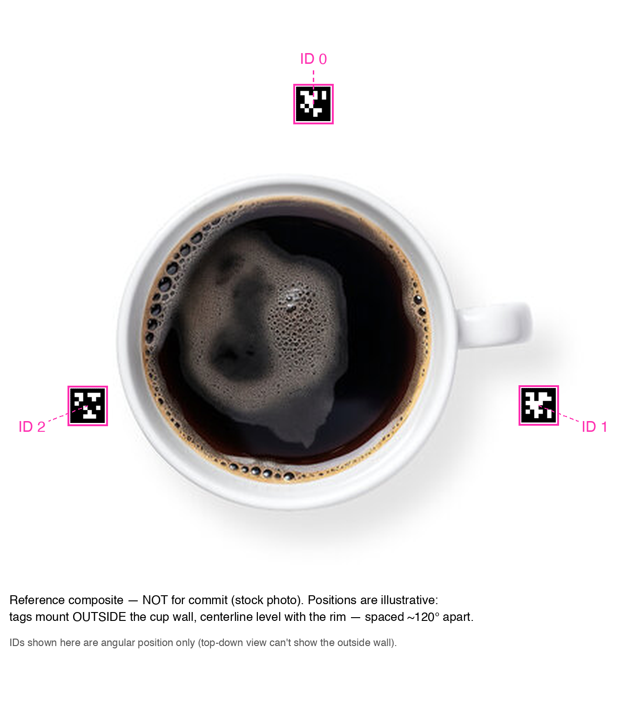
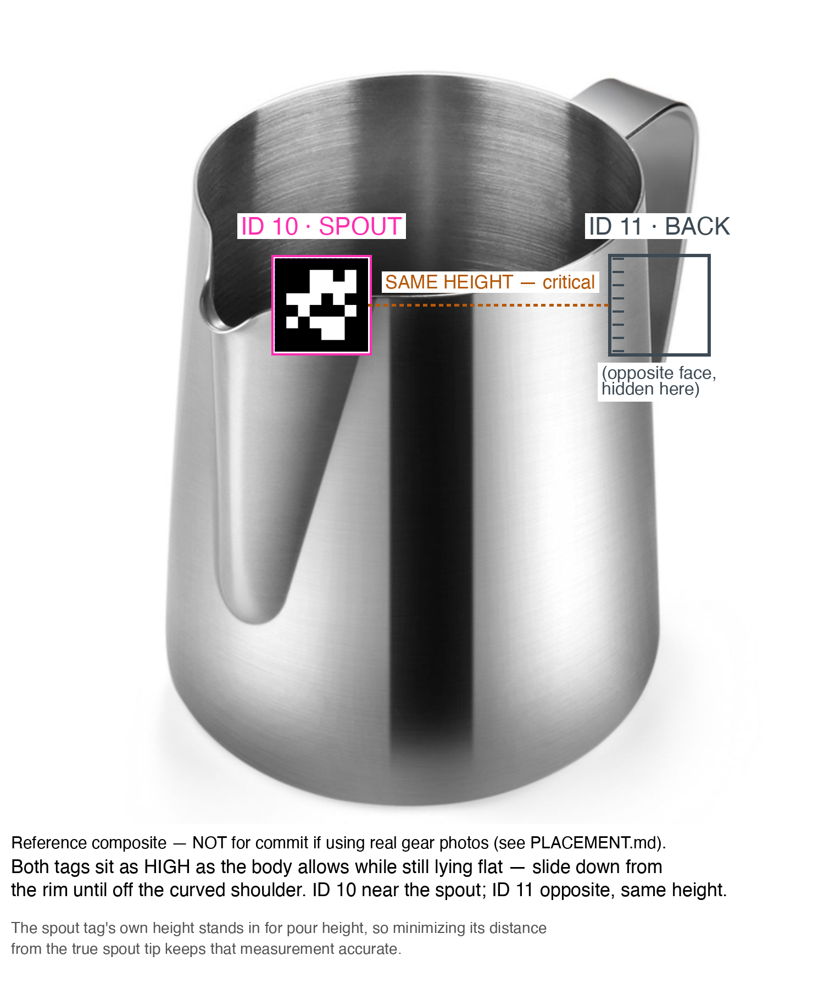

# AprilTag printing & placement

Physical setup for the sensor rig: 3 tags on the cup, 2 on the pitcher, all `tag36h11`, all **24 mm** per side (the outer black border — see below).

## What to print

Print [`print_sheet.pdf`](print_sheet.pdf) at **100% / Actual Size** (PDF viewers default to this — avoid any "fit to page"/"shrink to fit" option). The PDF's page size is exactly 136×154&nbsp;mm with the true 24&nbsp;mm tag dimensions baked directly into the page geometry — not just image metadata a print dialog can silently ignore — so it's the more reliable format to print from. [`print_sheet.png`](print_sheet.png) (same layout, 304.8 DPI) is provided as a fallback if you need a raster image instead. Individual tags are also available separately: [`tag_0.png`](tag_0.png), [`tag_1.png`](tag_1.png), [`tag_2.png`](tag_2.png), [`tag_10.png`](tag_10.png), [`tag_11.png`](tag_11.png).

After printing, **measure the verification ruler printed on the sheet**. It must measure exactly 60 mm.
- If it does: measure any magenta-outlined square — it should be 24 mm per side. You're set; `AprilTagRoles.cupTagSizeMeters` / `pitcherTagSizeMeters` in `LatteArt/Sensor/AprilTagTracker.swift` are already `0.024` and need no change.
- If it doesn't (e.g. your printer rescaled to fit the page): compute `measured_ruler_mm / 60 × 24 mm` — that's your actual printed tag size in mm. Convert to meters and set both `AprilTagRoles.cupTagSizeMeters` and `pitcherTagSizeMeters` to that value (they can differ if the cup and pitcher sheets were printed at different times/settings — just measure each sheet's own ruler).

**The dimension that matters is the outer black-border square only** (the region outlined in magenta) — not the white margin around it. This matches `SwiftAprilTag`'s documented `tagSize` semantics exactly (`Detection.estimatePose`'s doc comment: "physical edge length of the tag's outer black border... NOT the full tag image including any white margin").

Mount each tag flat, uncurled, and matte if possible (glossy laminate can glare and wash out the black/white contrast under strong light).

## Tag → ID map

| Tag ID | Family | Role | Mounts on |
|---|---|---|---|
| 0, 1, 2 | tag36h11 | Cup rim (×3) | Cup, outside wall, evenly spaced |
| 10 | tag36h11 | Pitcher spout | Pitcher, side nearest the spout |
| 11 | tag36h11 | Pitcher back | Pitcher, side directly opposite the spout tag |

These IDs are hardcoded in `AprilTagRoles` (`LatteArt/Sensor/AprilTagTracker.swift`) — if you print different IDs, update the code to match, not the other way around.

## Cup placement (3 tags — IDs 0, 1, 2)

*Reference composite built on a stock photo, for illustrating angular position only — swap in a photo of the actual cup once available.*

- Mount all 3 tags on the **outside** wall of the cup, spaced **evenly around the circumference** (roughly 120° apart — exact spacing doesn't matter, but avoid clustering all 3 on one side, which makes the circumcircle math (`CupGeometry.fromCupTags`) numerically unstable).
- Align each tag so its **horizontal centerline sits level with the cup's rim** (the top edge) — e.g. the tag straddles the rim, half above/half below. This matters: the app treats the plane through the 3 tags' centers as "the rim plane" and measures pitcher pour-height relative to it (`heightAboveRimMeters`). If the tags are mounted well below the rim instead, every height reading will carry a constant offset.
- Face each tag outward (flat against the cup's side wall, normal pointing away from the cup), so it's visible to a phone camera positioned above/in front of the cup during a pour.
- ID order doesn't matter functionally (the code reads all 3 by ID, not position) — but for your own sanity when debugging, a natural convention is ID 0 facing the camera's default position, 1 and 2 spaced clockwise from it.

## Pitcher placement (2 tags — IDs 10, 11)

*Reference composite built on a stock photo — swap in a photo of the actual pitcher once available.*

- **ID 10 (spout)**: mount on the flat face of the pitcher closest to the spout.
- **ID 11 (back)**: mount on the flat face **directly opposite** the spout tag (180° around the pitcher body).
- **Height — as high on the body as the tag will sit flat.** `AprilTagPourSource` uses the spout tag's own 3D position as the pour-height measurement directly (`cup.heightAbovePlane(spout)`) — it doesn't know where the physical spout tip is relative to the tag, so whatever vertical gap exists between the tag and the actual spout tip becomes a constant error in every height reading. Minimize that gap: **starting from the rim, slide the tag down the body until the whole square sits flat against the wall** (not bent over the curved shoulder just below the rim) — that's the mounting spot. On most pitchers this lands the tag's top edge a few mm to ~1–2 cm below where the rim's curve ends and the straight wall begins.
  - This leaves a small (roughly one tag-height, ~2–3 cm) built-in offset between the tag and the true spout tip — acceptable relative to typical pour heights (several cm), and not something to over-engineer by hand-measuring; if it turns out to matter, add a fixed calibration constant in `AprilTagPourSource` once you've measured your specific pitcher, rather than chasing sub-mm placement.
- **Critical: both tags must be at the exact same height on the pitcher.** Tilt is computed from the vertical component of the vector between them (`AprilTagPourSource`: `atan2(|spout.y - back.y|, horizontalDistance)`) — if one tag sits higher than the other, that height difference reads as a constant fake "resting tilt" even when you're holding the pitcher level, and every tilt/flow reading downstream will be biased by it. Mount both by the same "slide down from the rim until flat" procedure so they land level with each other, even if the rim itself isn't perfectly level between the spout and back sides.
- Mount both on flat vertical panels, facing outward, so at least one stays visible to the camera through a natural pouring motion (tilting the pitcher tips the back tag toward the camera and the spout tag away, or vice versa depending on pour direction — see the occlusion note below). If the handle attachment blocks the exact opposite point, shift the back tag a little to either side — exact 180° isn't required, just roughly opposite and at the same height.

## Known risk: occlusion during a real pour

The spout tag is the one most likely to get wet or blocked by the liquid stream or your hand mid-pour. `AprilTagPourSource` has a 150 ms grace period so a single dropped frame doesn't kill the pour, but sustained occlusion (tag fully wet, or your hand covering it for longer than that) will stop the pour signal. This is a known, not-yet-solved risk — flagged in the Sensor issue on GitHub as the first thing to test once tags are physically mounted.
